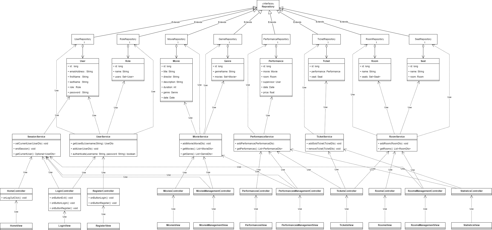
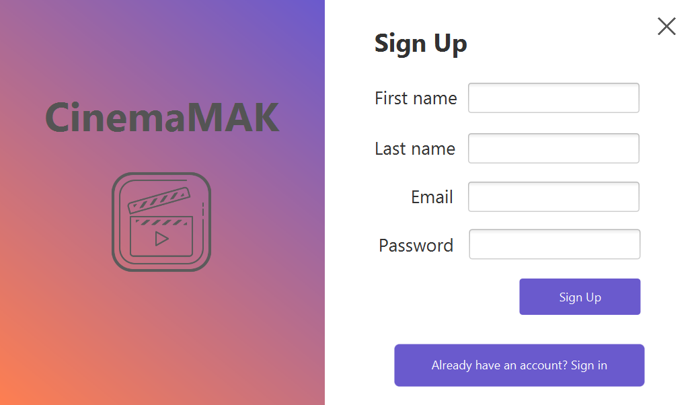

# CinemaMAK

  
Spis treści

  <ol>
    <li>
      <a href="#skład">Skład</a>
    </li>
    <li>
      <a href="#technologie">Technologie</a>
    </li>
    <li>
      <a href="#opis-projektu">Opis projektu</a>
    </li>
    <li>
      <a href="#model-obiektowy">Model obiektowy</a>
    </li>
    <li>
      <a href="#schemat-bazy-danych">Schemat bazy danych</a>
    </li>
    <li>
      <a href="#widoki">Widoki</a>
    </li>
  </ol>

## Skład
- Skowron Mateusz
- Chrobot Adrian
- Wilk Karol

## Technologie
- Java
- Gradle
- Spring Framework
- JavaFX
- PostgreSQL

## Opis projektu
Projekt jest to aplikacja desktopowa udostępniająca system do obsługi multipleksu kinowego.

Do cześci frontendowe apliakacji została wykorzystana JavaFX, a odpowiednie widoki zaimplementowane w postaci plików FXML.
Część backendowa została zaimplementowana przy użyciu Javy oraz Spring Framework'a.
Dane przechowywane są w relacyjnej bazie danych. Jako system do zarządzania relacyjną bazą danych wybrano jeden z popularniejszych systemów - PostgreSQL.
Automatyzacje procesu kompilacji zapewnia narzędzie - Gradle.

Obecnie aplikacja umożliwa założenie konta w systemie i zalogowanie się, co prezentowane jest na dwóch widokach, pomiędzy którymi można się przełączać.
Użytkownik chcąc założyć konto musi podać niezbędne do tego dane.
Proces uwierzytelniania wymaga podania nazwy użytkownika, którą jest adres email oraz hasła.
Do haszowania haseł wykorzystano funkcję bcrypt. Hasła w postaci zahaszowanej trzymane są w bazie danych w odpowiedniej tabeli.

## Model obiektowy

## Schemat bazy danych

## Widoki
- Logowanie
  

- Rejestracja
  
