# CinemaMAK
## Spis treści
* [Skład](#skład)
* [Technologie](#technologie)
* [Opis projektu](#opis-projektu)
* [Model obiektowy](#model-obiektowy)
* [Schemat bazy danych](#schemat-bazy-danych)
* [Widoki](#widoki)
* [Instalacja](#instalacja)
* [Uruchomienie](#uruchomienie)

<a name="skład"></a>
## Skład
- Skowron Mateusz
- Chrobot Adrian
- Wilk Karol

<a name="technologie"></a>
## Technologie
- Java
- Gradle
- Spring Framework
- JavaFX
- PostgreSQL
- Docker

<a name="opis-projektu"></a>
## Opis projektu
Projekt jest to aplikacja desktopowa udostępniająca system do obsługi multipleksu kinowego.

Do cześci frontendowej apliakacji została wykorzystana JavaFX, a odpowiednie widoki zaimplementowane w postaci plików FXML.
Część backendowa została zaimplementowana przy użyciu Javy oraz Spring Framework'a.
Dane przechowywane są w relacyjnej bazie danych. Jako system do zarządzania relacyjną bazą danych wybrano jeden z popularniejszych systemów - PostgreSQL.
Automatyzacje procesu kompilacji zapewnia narzędzie - Gradle.

Obecnie aplikacja umożliwa założenie konta w systemie i zalogowanie się, co prezentowane jest na dwóch widokach, pomiędzy którymi można się przełączać.
Użytkownik chcąc założyć konto musi podać niezbędne do tego dane.
Proces uwierzytelniania wymaga podania nazwy użytkownika, którą jest adres email oraz hasła.
Do haszowania haseł wykorzystano funkcję bcrypt. Hasła w postaci zahaszowanej trzymane są w bazie danych w odpowiedniej tabeli.

<a name="model-obiektowy"></a>
## Model obiektowy
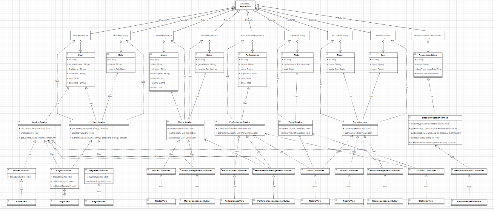

Warstwa persystencji realizowana jest poprzez JPA (wzorzec Repository).

Obiekty `Repository` (`UserRepository`, `RoleRepository`, `MovieRepository`, `GenreRepository`, `TicketRepository`, `PerformanceRepository`, `RoomRepository`, `SeatRepository`) udostępniają poprzez JPA kwerendy, których wynikami są encje i kolekcje encji.

Obiekty `Service` korzystają z funkcjonalności obiektów `Repository` i udostępniają bardziej ograniczone i złożone API w celu wprowadzenia warstwy abstrakcji pomiędzy kontrolerami i warstwą persystencji. Warto zauważyć, że niektóre obiekty `Service` obsługują więcej niż jeden obiekt `Repository`. Dzieje się tak, kiedy `Repository` ma znaczenie jedynie w kontekscie innej encji (np. encje `Role` mają znaczenie jedyne w konteksie encji `User`).

Następna warstwa aplikacji składa się z obiektów `Controller`, które realizują finkcjonalność warstwy kontrolerów we wzorcu MVC. Korzystając z obiektów `Service` realizują wysokopoziomową logikę biznesową. W szczególności można wyróżnić trzy główne typy kontrolerów:

- Kontrolery sesji i uwierzytelniania, odpowiedzialne za rejestrację/logowanie
- Kontrolery administracyjne (`Management`), dostępne jedynie dla Admina/Menedżera, pozwalające na modyfikację danych
- Kontrolery wyświetlania, dostępne dla zwykłego użytkownika. Nie pozwalają one na wprowadzanie zmian. Wyjątkiem jest kontroler `TicketController`, który pracownikowi pozwala na rejestrację sprzedaży biletów.

Każdemu kontrolerowi przypada odpowiedni widok - są to widoki `FXML` z biblioteki JavaFX, pozwalające na imlpementację reaktywnego GUI poprzez powiązania `Binding` JavaFX.

<a name="schemat-bazy-danych"></a>
## Schemat bazy danych
Ze względu na potrzebę zapewnienia wszystkich potrzebnych informacji, które zostaną wykorzystane do statystyk
oraz są niezbędne do poprawnego działania systemu, zgodnie z wymaganiami, w bazie znalazły się następujące tabele:


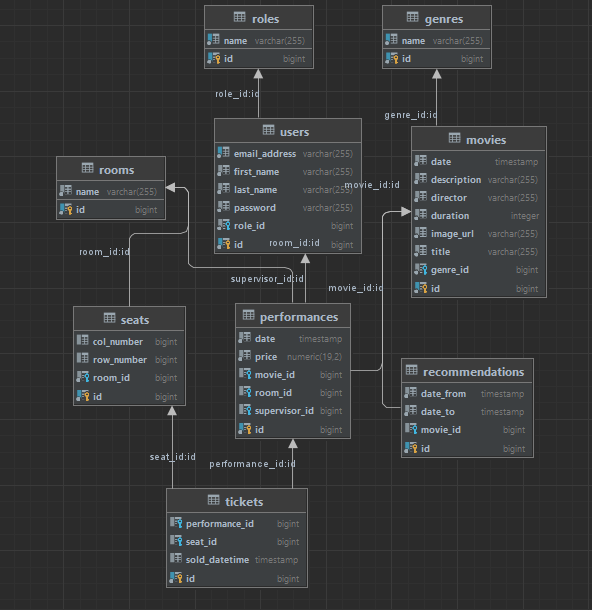

- **Roles** - Pełni funkcję słownika. Zawiera role użytkowników występujące w systemie. \
  Dane znajdujące się w tabeli wczytywane są z pliku *roles.txt* przy starcie aplikacji. \
  W trakcie działania aplikacji nie będzie możliwości dodania innych ról, gdyż muszą być one wcześniej zdefiniowane, aby aplikacja działała poprawnie.


- **Genres** - Pełni funkcję słownika. Zawiera gatunki filmów występujące w systemie. \
  Dane znajdujące się w tabeli wczytywane są z pliku *genres.txt* przy starcie aplikacji.\
  W trakcie działania aplikacji będzie możliwość dodania innych gatunków do tabeli.


- **Users** - Zawiera dane użytkowników systemu. \
  Klucz obcy *role_id* wskazuje rekord z tabeli roles, definiuje rolę użytkownika w systemie.


- **Movies** - Zawiera dane filmów, które były/będą transmitowane w kinie. \
  Klucz obcy *genre_id* wskazuje rekord z tabeli genres, definiuje gatunek filmu.


- **Rooms** - Zawiera sale kinowe, które znajdują sie w placówce kina.


- **Seats** - Zawiera miejsca dostępne w kinie. \
  Klucz obcy *room_id* wskazuje rekord z tabeli rooms, definiuje to, w której sali kinowej znajduję się dane miejsce.


- **Performances** - Zawiera dane seansów, które odbyły/odbędą się w kinie. \
  Klucz obcy *movie_id* wskazuje rekord z tabeli movies, definiuje to, jaki film był/będzie transmitowany na danym seansie. \
  Klucz obcy *room_id* wskazuje rekord z tabeli rooms, definiuje to, w jakiej sali odbył/odbędzie się seans. \
  Klucz obcy *supervisor_id* wskazuje rekord z tabeli users, definiuje to, który pracownik pełni opiekę nad danym seansem.


- **Recommendations** - Zawiera polecenia, które były/będą w danych dniach. \
  Klucz obcy *movie_id* wskazuje rekord z tabeli movies, definiuje to, który film był/będzie polecany w danej rekomendacji.


- **Tickets** - Zawiera bilety, na dane seanse. \
  Klucz obcy *performance_id* wskazuje rekord z tabeli performances, definiuje to, na był/jaki seans jest dany bilet.
  Klucz obcy *seat_id* wskazuje rekord z tabeli seats, definiuje to, które miejsce zostało zarezerwowane.

<a name="widoki"></a>
## Widoki
- **Logowanie**

  

  Widok umożliwia logowanie się do systemu. \
  Należy podać poprawny adres email w pierwszym polu formularza oraz hasło w drugim. \
  Po podaniu niepoprawnych danych pojawa się wyskakującę okno blokujące działanie aplikacji w tle,
  informującę o błędzie. Po jego zamknięciu możliwa jest kolejna próba logowania. \
  Po poprawnym zalogowaniu zostajemy przeniesieni do głównego okna aplikacji. \
  Przycisk *Sign In* zatwierdza formularz. \
  Przycisk *Don't have an account? Sign up* umożliwia przejścia do okna rejestracji użytkownika.


- **Rejestracja**

  

  Widok umożliwia założenie konta w systemie. \
  Po podaniu niepoprawnych lub niekompletnych danych pojawa się wyskakującę okno blokujące działanie aplikacji w tle,
  informującę o błędzie. Po jego zamknięciu możliwa jest kolejna próba rejestracji. \
  Po poprawnym utworzeniu konta zostajemy przeniesieni do okna logowania. \
  Przycisk *Sign Up* zatwierdza formularz.\
  Przycisk *Already have an account? Sign in* umożliwia przejścia do okna logowania.


- **Widok główny aplikacji**

  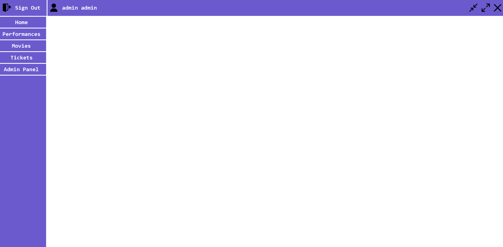

  W górnym lewym rogu za pomocą przycisku *Sign out* możemy się wylogować. \
  Obok przycisku służącego do wylogowywania widoczny jest aktualnie zalogowany użytkownik. \
  Po lewej stronie widoku znajduje się panel boczny, za pomocą którego możemy przełączać widoki.
  

- **Filmy**

  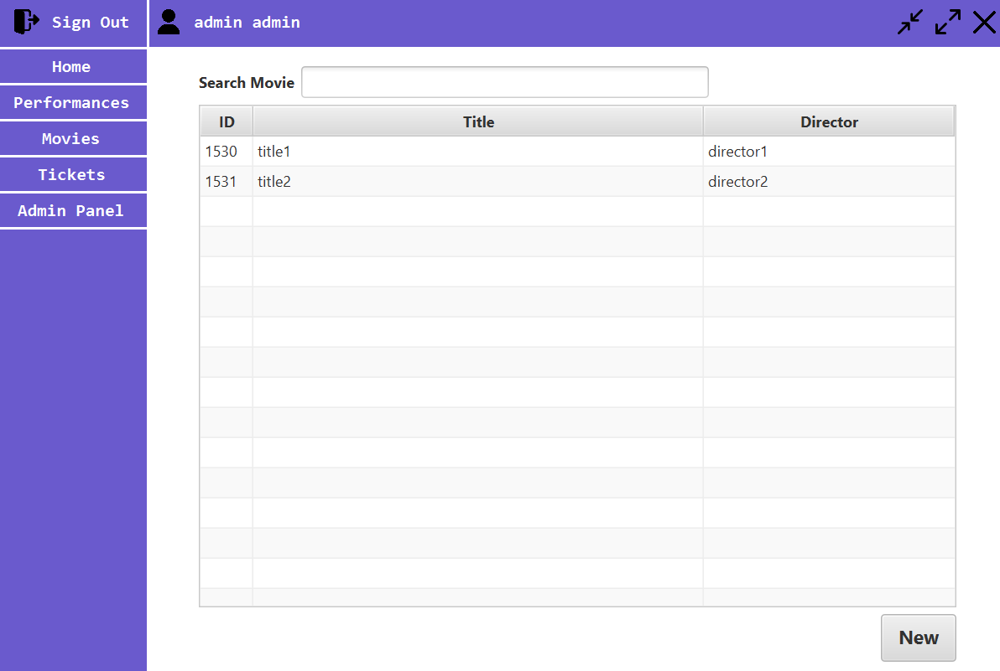

  Widok dostępny jest dla użytkowników z rolą admina/menadżera. \
  W tabeli wyświetlane są filmy obecnie znajdującę się w bazie. \
  W górnej części widoku znajduje się pole tekstowe, w którym możemy wyszukać film po tytule lub reżyserze. \
  Po dwukrotnym wciśnięciu danego rekordu wyświetla się widok szczegółowych danych o filmie. \
  Po kliknięciu w przycisk *NEW* otwiera się formularz dodawania nowego filmu. 

  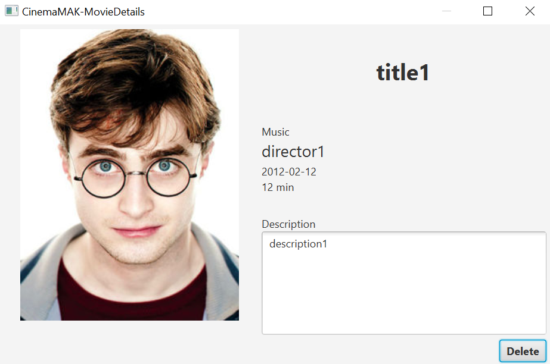
  
  Za pomocą przycisku *Delete* możemy usunąć film.

  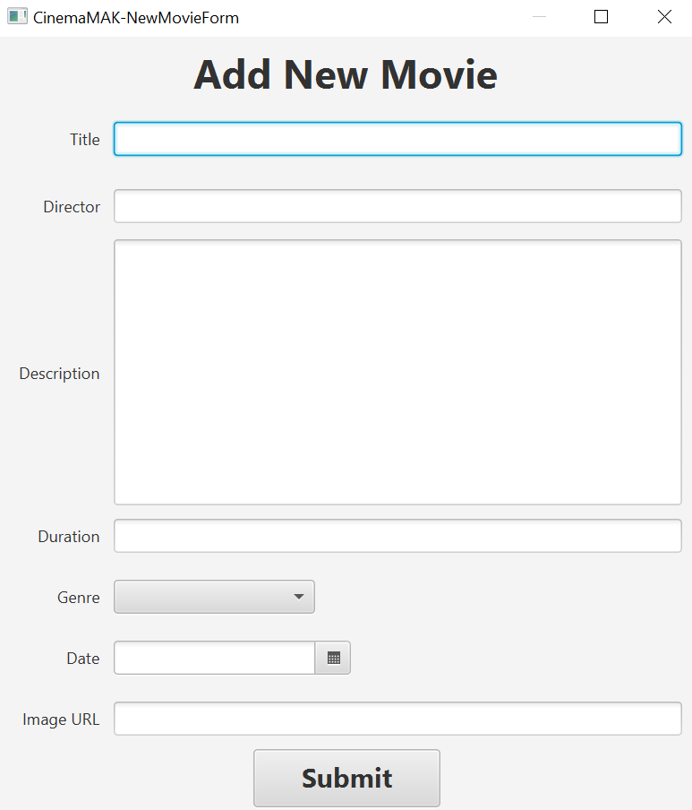

  Po poprawnym uzupełnieniu danych i wciśnięciu przycisku *Submit* film zostaje dodany do bazy danych. 


- **Seanse**

  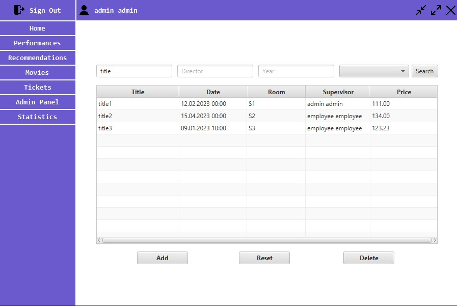

  Widok dostępny jest dla użytkowników z rolą admina/menadżera. \
  W tabeli wyświetlane są seanse obecnie zarejestrowane w bazie. \
  Seanse można wyświetlić w tabeli po uprzednim ich wyszukaniu \
  za pomocą odpowiednich pól u góry widoku i kliknięciu przycisku *Search*.\
  Przycisk *Reset* służy do czyszczenia tabeli z wyszukiwanych wyników. \
  Po wskazaniu seansu i wciśnięciu przycisku *Delete* zostaje on usunięty. \
  Po wciśnięciu przycisku *Add* otwiera się formularz dodawania nowego seansu.\
  Po dwukrotnym kliknięciu *Wiersza* otwiera się formularz edytowania seansu. \


  

  Po poprawnym uzupełnieniu danych i wciśnięciu przycisku *Add* seans zostaje zatwierdzony.

  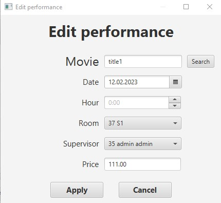

  Po poprawnym uzupełnieniu danych i wciśnięciu przycisku *Apply* seans zostaje zatwierdzony.

- **Rekomendacje**

  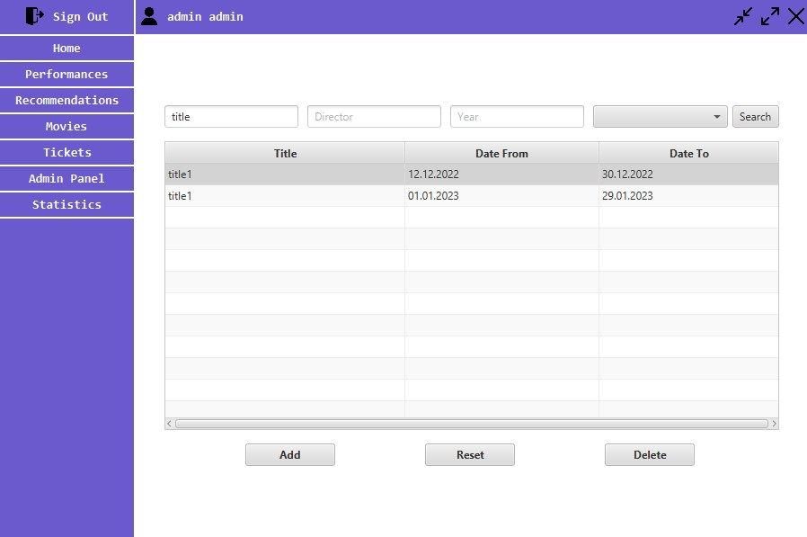

  Widok dostępny jest dla użytkowników z rolą admina/menadżera. \
  W tabeli wyświetlane są rekomendacje obecnie zarejestrowane w bazie. \
  Rekomendacje można wyświetlić w tabeli po uprzednim ich wyszukaniu \
  za pomocą odpowiednich pól u góry widoku i kliknięciu przycisku *Search*.\
  Przycisk *Reset* służy do czyszczenia tabeli z wyszukiwanych wyników. \
  Po wskazaniu rekomendacji i wciśnięciu przycisku *Delete* zostaje on usunięty. \
  Po wciśnięciu przycisku *Add* otwiera się formularz dodawania nowej rekomendacji.\
  Po dwukrotnym kliknięciu *Wiersza* otwiera się formularz edytowania rekomendacji.

  

  Po poprawnym uzupełnieniu danych i wciśnięciu przycisku *Add* rekomendacja zostaje zatwierdzona.

  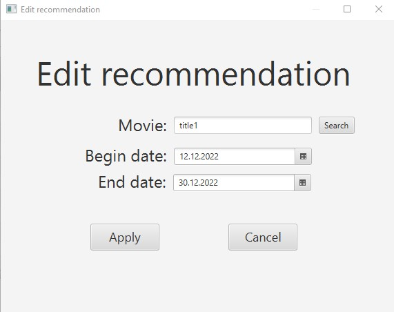

  Po poprawnym uzupełnieniu danych i wciśnięciu przycisku *Apply* rekomandacja zostaje zatwierdzona.

  Dla widoków dodawania i edycji rekomendacji oraz seansów:
  Po kliknięciu przycisku *Search* obok pola tekstowego z tytułem filmu można przejść do widoku wyszukiwania filmu.

  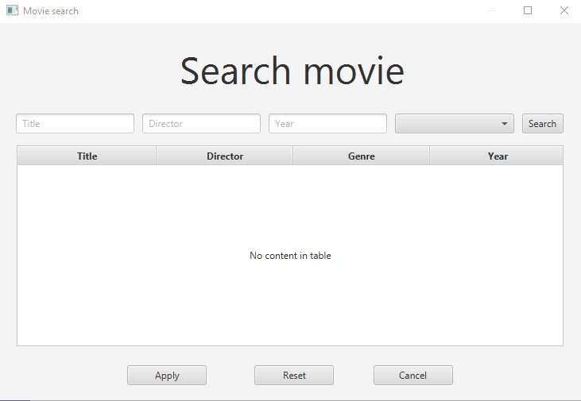

  Filmy można wyświetlić w tabeli po uprzednim ich wyszukaniu \
  za pomocą odpowiednich pól u góry widoku i kliknięciu przycisku *Search*.\
  Przycisk *Reset* służy do czyszczenia tabeli z wyszukiwanych wyników. \
  Przycisk *Apply* służy do dodania filmu do pola tekstowego. \
  Przycisk *Cancel* służy do wyjścia z widoku.


- **Bilety**

  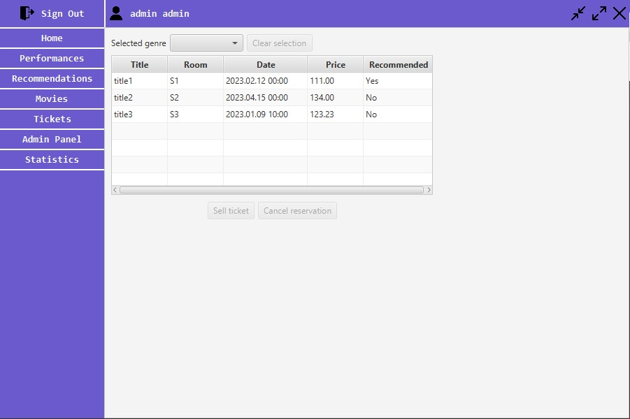
  
  Widok dostępny jest dla wszystkich użytkowników, niezależnie od roli. \
  Widok na początku wyświetla listę seansów, z których użytkownik wybiera jeden. \
  Za pomocą *Select genre* można wyświetlić tylko filmy z danej kategorii. \
  Wówczas wyświetli się tabela z nazwami poszczególych foteli w sali, w której odbędzie się seans.

  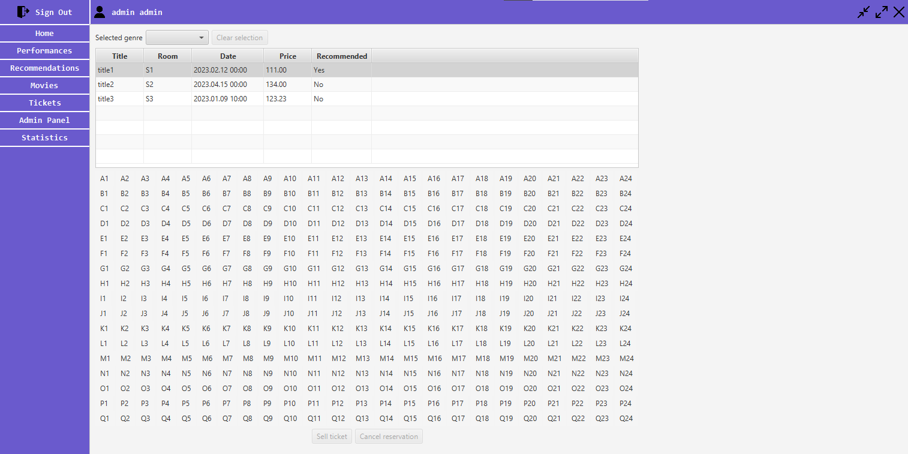

  Użytkownik wybiera odpowiedni fotel klikając w jego nazwę.

  

  Z pomocą przycisku "Sell ticket" użytkownik może sprzedać bilet na wybrany fotel w danym seansie.

  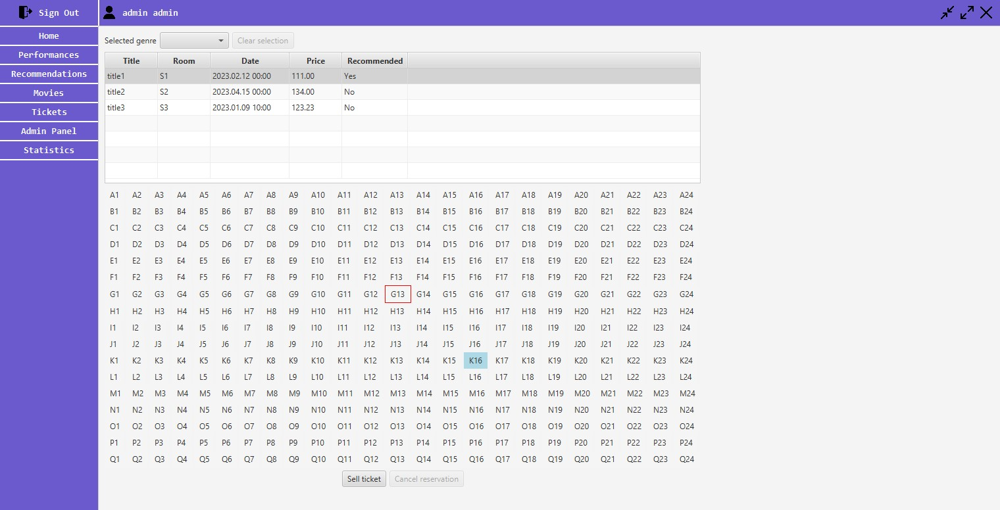

  Nazwa fotela jest obramowana na czerwono, co oznacza, że ten fotel jest zarezerwowany i nie da się sprzedać biletu na ten fotel i seans. \
  W przypadku zwrotu biletu, użytkownik może wybrać zarezerwowany fotel w celu realizacji zwrotu.

  

  Za pomocą przycisku "Cancel reservation" rezerwacja na fotel jest anulowana.

  

- **Statystyki**

  Dla Administratora i Menedżera dostępny jest widok statystyk podzielony na dwie części.
  
  Widok statystyk ogólnych pokazuje rozkład filmów oraz zaplanowanych seansów na poszczególne gatunki

  

  Widok szczegółowych raportów pozwala użytkownikowi na wprowadzenie zakresu dni, z jakich należy wygenerować raport. Po naciśnięciu przycisku "Generate Reports" pojawią się wykresy przedstawiające liczbę sprzedanych biletów oraz sumę zysków za te bilety.

  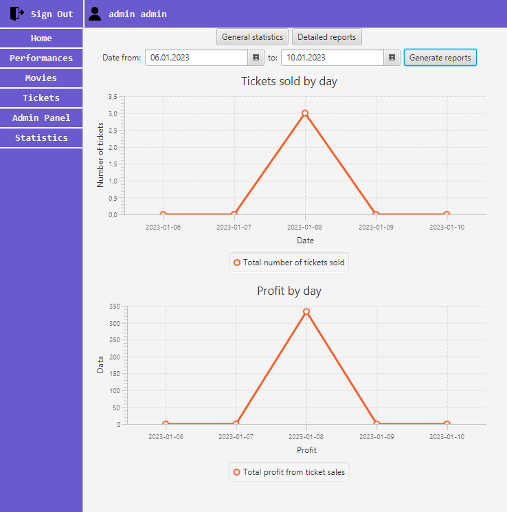

- **Panel administratora**

  

  Widok dostępny jest jedynie dla użytkownika z rolą administratora. \
  Administrator systemu może zmieniać rolę użytkowników wybierając ich z listy, a następnie po wyborze roli zatwierdzić ją przyciskiem *Set*. \
  Dodatkowo po zaznaczeniu *Send Email Notification* zostanie wysłany email do użytkownika powiadamiający go o zmianie jego roli.

<a name="instalacja"></a>
## Instalacja
```
git clone https://bitbucket.lab.ii.agh.edu.pl/scm/to2022/jk-pn-1300-cinemamak.git
```

<a name="uruchomienie"></a>
## Uruchomienie
Pierwszym krokiem jest uruchomienie bazy danych, która będzie działać w kontenerze.  
W katalogu głównym projektu wykonujemy polecenie:
```
docker compose -f .\src\main\resources\docker-compose.yml up -d
```
Następnie uruchamiamy aplikację:
```
./gradlew bootRun
```