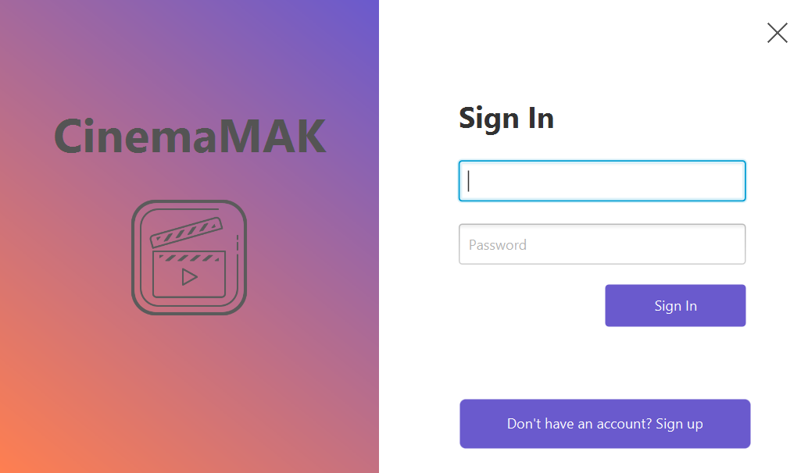

# CinemaMAK
## Spis treści
* [Skład](#skład)
* [Technologie](#technologie)
* [Opis projektu](#opis-projektu)
* [Model obiektowy](#model-obiektowy)
* [Schemat bazy danych](#schemat-bazy-danych)
* [Widoki](#widoki)
* [Instalacja](#instalacja)
* [Uruchomienie](#uruchomienie)

## Skład
- Skowron Mateusz
- Chrobot Adrian
- Wilk Karol

## Technologie
- Java
- Gradle
- Spring Framework
- JavaFX
- PostgreSQL
- Docker

## Opis projektu
Projekt jest to aplikacja desktopowa udostępniająca system do obsługi multipleksu kinowego.

Do cześci frontendowej apliakacji została wykorzystana JavaFX, a odpowiednie widoki zaimplementowane w postaci plików FXML.
Część backendowa została zaimplementowana przy użyciu Javy oraz Spring Framework'a.
Dane przechowywane są w relacyjnej bazie danych. Jako system do zarządzania relacyjną bazą danych wybrano jeden z popularniejszych systemów - PostgreSQL.
Automatyzacje procesu kompilacji zapewnia narzędzie - Gradle.

Obecnie aplikacja umożliwa założenie konta w systemie i zalogowanie się, co prezentowane jest na dwóch widokach, pomiędzy którymi można się przełączać.
Użytkownik chcąc założyć konto musi podać niezbędne do tego dane.
Proces uwierzytelniania wymaga podania nazwy użytkownika, którą jest adres email oraz hasła.
Do haszowania haseł wykorzystano funkcję bcrypt. Hasła w postaci zahaszowanej trzymane są w bazie danych w odpowiedniej tabeli.

## Model obiektowy


Warstwa persystencji realizowana jest poprzez JPA (wzorzec Repository).

Obiekty `Repository` (`UserRepository`, `RoleRepository`, `MovieRepository`, `GenreRepository`, `TicketRepository`, `PerformanceRepository`, `RoomRepository`, `SeatRepository`) udostępniają poprzez JPA kwerendy, których wynikami są encje i kolekcje encji.

Obiekty `Service` korzystają z funkcjonalności obiektów `Repository` i udostępniają bardziej ograniczone i złożone API w celu wprowadzenia warstwy abstrakcji pomiędzy kontrolerami i warstwą persystencji. Warto zauważyć, że niektóre obiekty `Service` obsługują więcej niż jeden obiekt `Repository`. Dzieje się tak, kiedy `Repository` ma znaczenie jedynie w kontekscie innej encji (np. encje `Role` mają znaczenie jedyne w konteksie encji `User`).

Następna warstwa aplikacji składa się z obiektów `Controller`, które realizują finkcjonalność warstwy kontrolerów we wzorcu MVC. Korzystając z obiektów `Service` realizują wysokopoziomową logikę biznesową. W szczególności można wyróżnić trzy główne typy kontrolerów:

- Kontrolery sesji i uwierzytelniania, odpowiedzialne za rejestrację/logowanie
- Kontrolery administracyjne (`Management`), dostępne jedynie dla Admina/Menedżera, pozwalające na modyfikację danych
- Kontrolery wyświetlania, dostępne dla zwykłego użytkownika. Nie pozwalają one na wprowadzanie zmian. Wyjątkiem jest kontroler `TicketController`, który pracownikowi pozwala na rejestrację sprzedaży biletów.

Każdemu kontrolerowi przypada odpowiedni widok - są to widoki `FXML` z biblioteki JavaFX, pozwalające na imlpementację reaktywnego GUI poprzez powiązania `Binding` JavaFX.

## Schemat bazy danych
Ze względu na potrzebę zapewnienia wszystkich potrzebnych informacji, które zostaną wykorzystane do statystyk
oraz są niezbędne do poprawnego działania systemu, zgodnie z wymaganiami, w bazie znalazły się następujące tabele:


- **Roles** - Pełni funkcję słownika. Zawiera role użytkowników występujące w systemie. \
  Dane znajdujące się w tabeli wczytywane są z pliku *roles.txt* przy starcie aplikacji. \
  W trakcie działania aplikacji nie będzie możliwości dodania innych ról, gdyż muszą być one wcześniej zdefiniowane, aby aplikacja działała poprawnie.


- **Genres** - Pełni funkcję słownika. Zawiera gatunki filmów występujące w systemie. \
  Dane znajdujące się w tabeli wczytywane są z pliku *genres.txt* przy starcie aplikacji.\
  W trakcie działania aplikacji będzie możliwość dodania innych gatunków do tabeli.


- **Users** - Zawiera dane użytkowników systemu. \
  Klucz obcy *role_id* wskazuje rekord z tabeli roles, definiuje rolę użytkownika w systemie.


- **Movies** - Zawiera dane filmów, które były/będą transmitowane w kinie. \
  Klucz obcy *genre_id* wskazuje rekord z tabeli genres, definiuje gatunek filmu.


- **Rooms** - Zawiera sale kinowe, które znajdują sie w placówce kina.


- **Seats** - Zawiera miejsca dostępne w kinie. \
  Klucz obcy *room_id* wskazuje rekord z tabeli rooms, definiuje to, w której sali kinowej znajduję się dane miejsce.


- **Performances** - Zawiera dane seansów, które odbyły/odbędą się w kinie. \
  Klucz obcy *movie_id* wskazuje rekord z tabeli movies, definiuje to, jaki film był/będzie transmitowany na danym seansie. \
  Klucz obcy *room_id* wskazuje rekord z tabeli rooms, definiuje to, w jakiej sali odbył/odbędzie się seans. \
  Klucz obcy *supervisor_id* wskazuje rekord z tabeli users, definiuje to, który pracownik pełni opiekę nad danym seansem.


- **Recommendations** - Zawiera polecenia, które były/będą w danych dniach. \
  Klucz obcy *movie_id* wskazuje rekord z tabeli movies, definiuje to, który film był/będzie polecany w danej rekomendacji.


- **Tickets** - Zawiera bilety, na dane seanse. \
  Klucz obcy *performance_id* wskazuje rekord z tabeli performances, definiuje to, na był/jaki seans jest dany bilet.
  Klucz obcy *seat_id* wskazuje rekord z tabeli seats, definiuje to, które miejsce zostało zarezerwowane.

## Widoki
- **Logowanie**

  

  Widok umożliwia logowanie się do systemu. \
  Po podaniu niepoprawnych danych pojawa się wyskakującę okno blokujące działanie aplikacji w tle,
  informującę o błędzie. Po jego zamknięciu możliwa jest kolejna próba logowania. \
  Po poprawnym zalogowaniu zostajemy przeniesieni do głównego okna aplikacji. \
  Przycisk *Exit* kończy działanie aplikacji, wychodzi z systemu.
  Przycisk *Log in* zatwierdza formularz. \
  Przycisk *Register* umożliwia przejścia do okna rejestracji użytkownika.


- **Rejestracja**

  

  Widok umożliwia założenie konta w systemie. \
  Po podaniu niepoprawnych lub niekompletnych danych pojawa się wyskakującę okno blokujące działanie aplikacji w tle,
  informującę o błędzie. Po jego zamknięciu możliwa jest kolejna próba rejestracji. \
  Po poprawnym utworzeniu konta zostajemy przeniesieni do okna logowania. \
  Przycisk *Exit* kończy działanie aplikacji, wychodzi z systemu. \
  Przycisk *Register* zatwierdza formularz.\
  Przycisk *Log in* umożliwia przejścia do okna logowania.

## Instalacja
```
git clone https://bitbucket.lab.ii.agh.edu.pl/scm/to2022/jk-pn-1300-cinemamak.git
```

## Uruchomienie
Pierwszym krokiem jest uruchomienie bazy danych, która będzie działać w kontenerze.  
W katalogu głównym projektu wykonujemy polecenie:
```
docker compose -f .\src\main\resources\docker-compose.yml up -d
```
Następnie uruchamiamy aplikację:
```
./gradlew bootRun
```